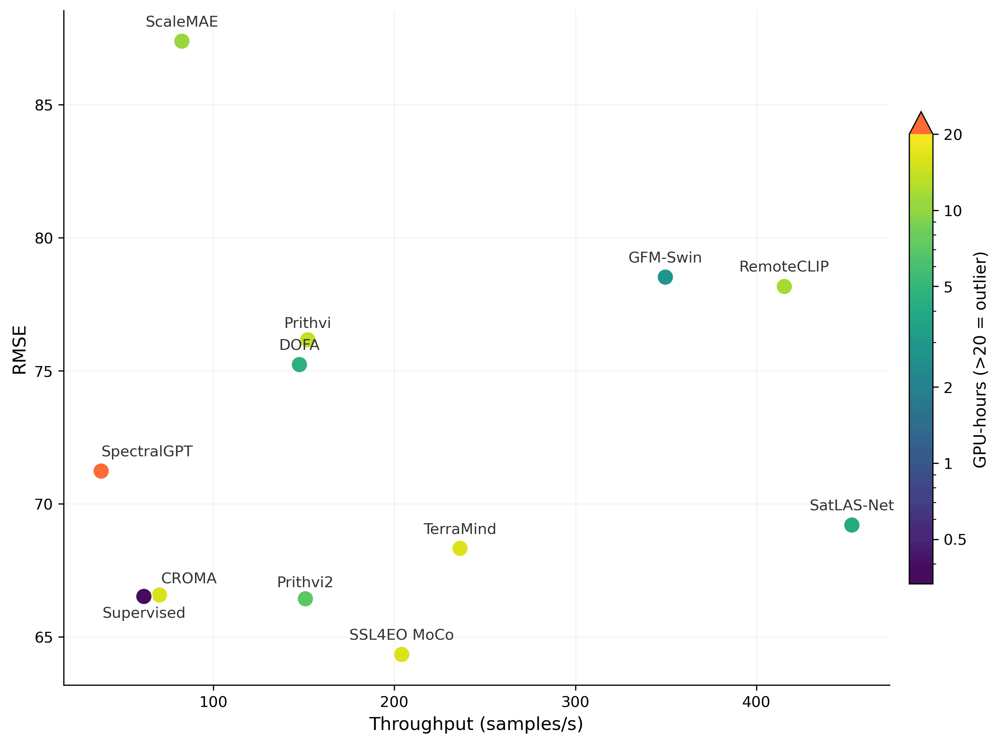
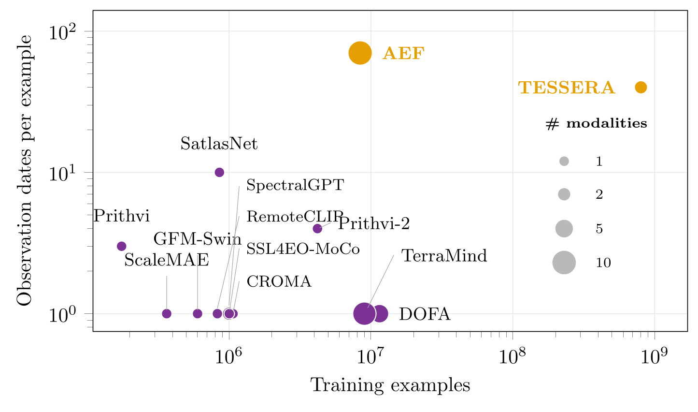
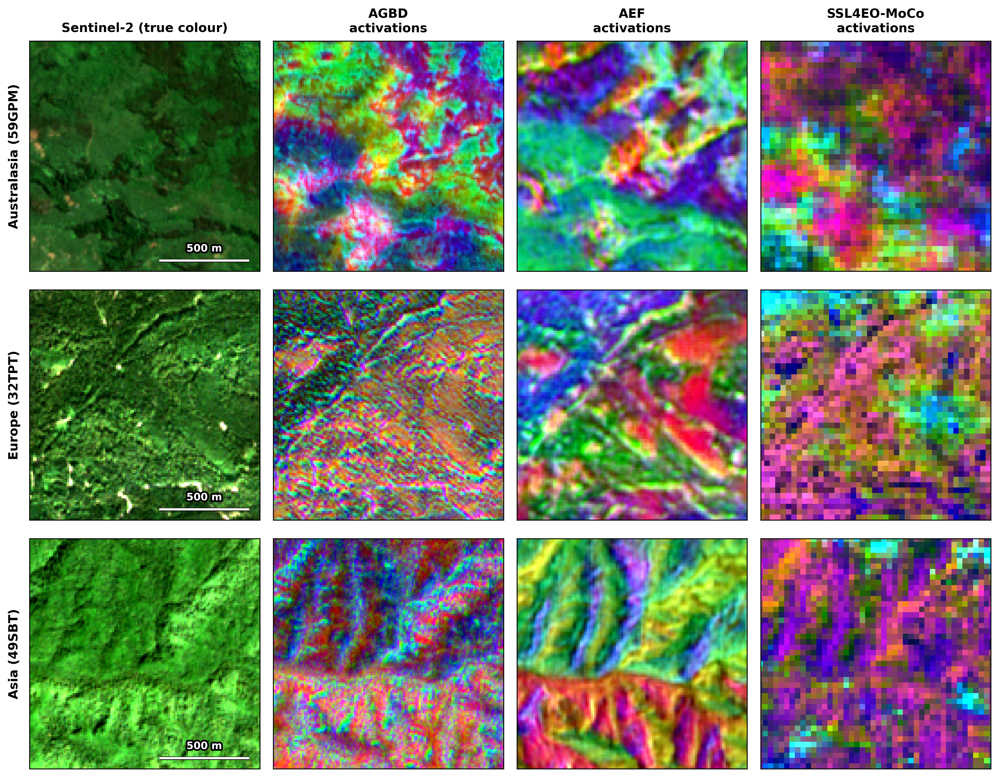
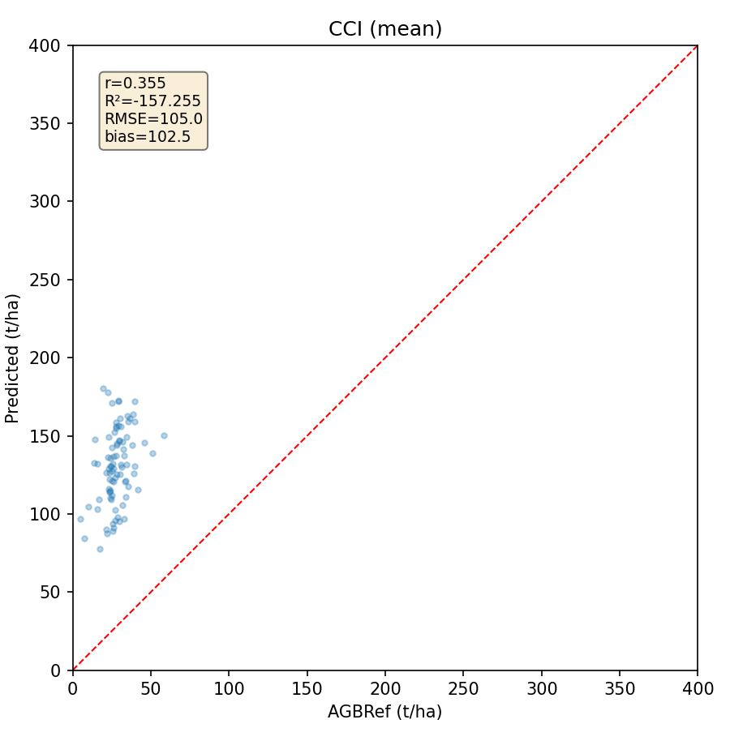
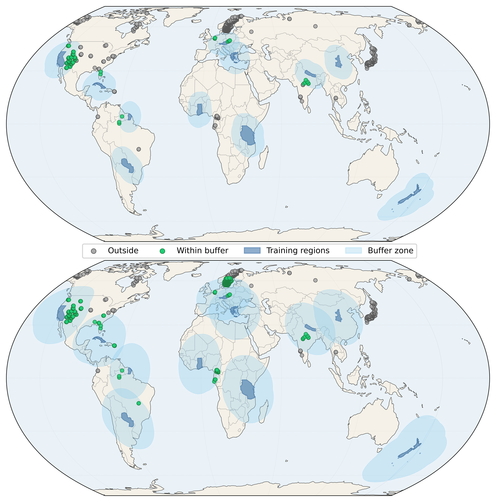

# Technical details

This page collects implementation details, extra figures and supporting analyses that support the paper but were left out of the main text for space. It follows the paper's structure, so each section can be read alongside the matching part of the manuscript.

**Contents**

1. [The AGBD Lite dataset and training regimes](#1-the-agbd-lite-dataset-and-training-regimes)
2. [PANGAEA implementation details](#2-pangaea-implementation-details)
3. [Benchmarked GFMs](#3-benchmarked-gfms)
4. [Prediction heads and supervised baseline](#4-prediction-heads-and-supervised-baseline)
5. [Learned activations](#5-learned-activations)
6. [AGBref reference plots](#6-agbref-reference-plots)
7. [References](#references)

---

## 1. The AGBD Lite dataset and training regimes

**Construction.** AGBD Lite is built by subsampling ≈5% of the GEDI footprints in each Sentinel-2 tile. For each region, the subsample is chosen to minimise the Wasserstein distance between the biome distribution of the subsample and that of the full dataset.

**Purpose.** AGBD Lite is a screening tool. It identifies the most promising GFMs before the more expensive full-scale evaluation on the complete AGBD dataset. As shown in the Lite-vs-Full table in the paper:

- it preserves **model rankings exactly**;
- training on it comes **within 3.5% of full-data RMSE** for our best configuration (52.72 vs. 50.92 Mg/ha);
- it does so at **≈5% of the cost**.

Results on AGBD Lite are therefore a slightly pessimistic estimate of performance on the full AGBD dataset, while relative comparisons between models carry over reliably.

**Training regimes.** Each model is trained under one of two regimes:

| Regime | Training data | Used for |
|---|---|---|
| **Full** | All available training samples | The most promising configurations |
| **Lite** | The distribution-matched 5% subset described above | Screening all GFMs |

The Lite regime exists because running many large frozen GFM encoders, and training their decoders until they converge, is expensive (see the [throughput figure](#fig-throughput) below). A 5% subset keeps the benchmark tractable. Because it is distribution-matched to the full set by construction, it remains a faithful proxy for screening.

---

## 2. PANGAEA implementation details

Each weight-distributed GFM is kept **frozen**, and a **UPerNet** decoder head is trained on top of it. The optimiser and learning-rate schedule follow PANGAEA's defaults:

| Setting | Value |
|---|---|
| Loss | Mean Squared Error (MSE) |
| Optimiser | AdamW |
| Initial learning rate | 1 × 10⁻⁴ |
| β | (0.9, 0.999) |
| Weight decay | 0.05 |
| Scheduler | MultiStepLR (γ = 0.1) |
| Milestones | 60% and 90% of training |
| Max epochs | 80 |
| Hardware | 1 × NVIDIA GeForce RTX 4090 |

For the pre-training modalities of each model, see [Benchmarked GFMs](#3-benchmarked-gfms).

  

> **LoRA** is applied to the attention projections of each pretrained encoder. We use rank $r = 8$ and $\alpha = 16$, so the update is scaled by $\alpha/r = 2$. Each adapted weight $W$ becomes $W + (\alpha/r)·BA$, where $A ∈ ℝ^{r×d_{in}}$ uses Kaiming-uniform initialisation and $B ∈ ℝ^{d_{out}×r}$ starts at zero, so the adapted encoder equals the pretrained one at the start of training. Targets are every linear layer directly inside the encoder's attention blocks (typically the fused query/key/value projection and the output projection), plus the input and output projections of any `nn.MultiheadAttention`. MLP blocks, patch embeddings and normalisation layers are not adapted. All original encoder weights are frozen, and only the low-rank adapters and the task decoder are trained.

> **Accuracy vs. efficiency.** AGBD Lite test RMSE (Mg/ha, lower is better) vs. inference throughput (samples/s) for all benchmarked GFMs. Colour shows the total GPU-hours needed to fine-tune on AGBD Lite until convergence on a single NVIDIA GeForce RTX 4090. Values above 20 GPU-hours are marked as outliers. For a fair comparison, the supervised model (`fcn_film`, Sentinel-2-only variant) is trained on the same data as the GFMs.

---

## 3. Benchmarked GFMs

### Input modalities and Sentinel-2 preprocessing

**Time:** *Single* = single-image input; *Multi* = multi-image (time-series) input.

| Model | Modalities | Time | Sentinel-2 processing |
|---|---|:---:|---|
| CROMA | Sentinel-2 L2A (12 bands); Sentinel-1 IW GRD | Single | Per-channel norm. with μ ± 2σ clipping, scaled to [0, 255] |
| DOFA | Sentinel-1, Sentinel-2, NAIP, Gaofen-2, EnMAP | Single | Per-channel norm. |
| GFM-Swin | RGB: NAIP, RSD46-WHU, MLRSNet, RESISC45, PatternNet | Single | Not applicable |
| Prithvi | HLS (RGB, NIR, SWIR 1, SWIR 2) | Multi | Per-channel norm. |
| Prithvi-2 | *same as Prithvi* | Multi | *same as Prithvi* |
| RemoteCLIP | RGB: SEG-4, DET-10, RET-3 | Single | Not applicable |
| SatlasNet | Sentinel-2 L1C (9 bands) | Multi | Per-channel norm. |
| ScaleMAE | RGB: Functional Map of the World (fMoW) | Single | Not applicable |
| SpectralGPT | Sentinel-2 (12 bands) | Single | Per-channel norm., scaled to [0, 1] |
| SSL4EO-MoCo | Sentinel-2 (13 bands) | Single | Per-channel norm.; ÷ 10,000 and clipped to [0, 1] |
| TerraMind | Sentinel-1 SAR (GRD, RTC); Sentinel-2 optical (L1C, L2A) | Single | Unspecified |
| AEF | *Inputs (inference):* Sentinel-2 L1C (B2, B3, B4, B8, B11); Sentinel-1 GRD; Landsat-8/9 L1C (B2, B3, B4, B5, B6, B8, B10). *Additional pre-training targets:* ALOS PALSAR-2 ScanSAR; Copernicus DEM GLO-30; GEDI L2A; ERA5-Land; GRACE; NLCD Land Cover; Wikipedia; GBIF | Multi | Log-transform and per-channel norm. with μ ± 6σ clipping |
| TESSERA | Sentinel-2 (10 bands); Sentinel-1 | Multi | Unspecified |

### Pre-training scale

  

> **Pre-training data on three axes:** number of training examples (*x*), number of observation dates combined in each example (*y*, temporal depth), and number of data modalities (marker size). **Orange:** GFMs that provide pre-computed embeddings. **Purple:** GFMs hosted on PANGAEA. AEF's date count is an estimate based on its frame-to-sequence ratio. The modality counts for TerraMind and AEF include auxiliary/derived and text sources. All other values are taken from the publications.

The coordinates come from each model's source publication or dataset release.

<b>Number of pre-training examples (x-axis)</b>

| Model | Pre-training examples | Source |
|---|---|---|
| CROMA | ≈1 M paired Sentinel-1/Sentinel-2 samples of SSL4EO-S12 | [Fuller et al., 2024](#ref-croma); [Wang et al., 2022](#ref-ssl4eo) |
| SSL4EO-MoCo | Same corpus: ≈251k locations × 4 seasons ≈ 1 M patches | [Wang et al., 2022](#ref-ssl4eo) |
| DOFA | ≈8–11.5 M single images across Sentinel-1/2, NAIP, Gaofen and EnMAP | [Xiong et al., 2024](#ref-dofa) |
| GFM-Swin | ≈600k images (GeoPile) | [Mendieta et al., 2023](#ref-gfmswin) |
| ScaleMAE | 363.6k images (fMoW-RGB split) | [Reed et al., 2023](#ref-scalemae) |
| SpectralGPT | ≈1.07 M images: fMoW-Sentinel (712,874) + BigEarthNet-S2 (354,196) | [Hong et al., 2024](#ref-spectralgpt) |
| RemoteCLIP | ≈828k image–text pairs | [Liu et al., 2024](#ref-remoteclip) |
| Prithvi | ≈175k HLS samples | [Jakubik et al., 2023](#ref-prithvi) |
| Prithvi-2 | ≈4.2 M HLS samples | [Szwarcman et al., 2026](#ref-prithvi2) |
| SatlasNet | 856k tiles (SatlasPretrain) | [Bastani et al., 2023](#ref-satlas) |
| TerraMind | ≈9 M patches (TerraMesh) | [Jakubik et al., 2025](#ref-terramind) |
| AEF | ≈8.4 M training sequences from more than 5 M sites | [Brown et al., 2025](#ref-alphaearth) |
| TESSERA | ≈800 M per-pixel annual series | [Feng et al., 2026](#ref-tessera) |

<b>Temporal depth (y-axis)</b>

- All weight-distributed GFMs are **single-date**, except:
  - **Prithvi**: 3 time steps ([Jakubik et al., 2023](#ref-prithvi));
  - **Prithvi-2**: 4 time steps ([Szwarcman et al., 2026](#ref-prithvi2));
  - **SatlasNet**: 8–12 Sentinel-2 acquisitions per tile ([Bastani et al., 2023](#ref-satlas)).
- **TESSERA** samples a fixed 40 observation dates per year ([Feng et al., 2026](#ref-tessera)).
- **AEF** reports ≈3 billion frames over ≈8.4 M sequences (≈350 frames each) but does not state a date count. We estimate **≈70 dates** by dividing the frame count by its number of input sensors. *This is the only estimated coordinate in the figure.*

<b>Modality breadth (marker size)</b>

We count the distinct sensor/data sources used in pre-training:

| # modalities | Models |
|:---:|---|
| 1 | Single-sensor optical models |
| 2 | Optical + SAR products (CROMA, TESSERA) |
| 5 | DOFA |
| 9 | TerraMind: its four Sentinel-1/2 products, plus DEM, NDVI, land cover, coordinates and captions |
| 10 | AEF: its Sentinel-2, Sentinel-1 and Landsat inputs, plus the PALSAR, GEDI, DEM, ERA5 climate, GRACE, land-cover and text sources it also learns from |

---

## 4. Prediction heads and supervised baseline

**Linear Probe (LP).** A single linear layer that maps the embeddings (64-dimensional for AEF, 128-dimensional for TESSERA) to an AGB estimate. It measures how linearly separable the biomass information is in the embedding space.

**Multi-Layer Perceptron (MLP).** A fully connected network with one hidden layer of 256 units and a ReLU activation, which captures non-linear relationships between the embeddings and AGB. The hidden size stays at 256 for both embedding products, so the head has the same capacity whatever the input dimensionality (64 for AEF, 128 for TESSERA). This separates the effect of the representation from the effect of the head.

> Each LP and MLP model is trained three times with different random seeds, and we report the mean and standard deviation.

**Supervised baseline (`fcn_film`).** A state-of-the-art model for AGB prediction: a fully convolutional neural network adapted from earlier work on canopy height estimation ([Lang et al., 2023](#ref-lang)) and biomass estimation ([Sialelli et al., 2025](#ref-agbd)). [Sialelli et al. (2025)](#ref-agbd) showed that it outperforms other models for AGB estimation. Our adapted version uses stochastically jittered Feature-wise Linear Modulation ([Perez et al., 2018](#ref-film)) for implicit ensembling, as proposed by [Turkoglu et al. (2022)](#ref-filmensemble). This gives well-calibrated estimates of epistemic uncertainty at low computational cost.

---

## 5. Learned activations

To probe **what** each representation encodes, the figure below shows the models' learned activations over small (≈1.3 km) windows of the same tiles. The activations are reduced to three dimensions with PCA and rendered as RGB.

**How to read it.** Colour marks position in the activation space, so regions with similar colours are represented similarly by the model. Absolute hues carry no meaning and cannot be compared across panels. What *can* be compared is the **spatial organisation**:

- **AEF** activations divide each scene into spatially coherent regions that follow terrain and land-cover boundaries, at the full 10 m resolution.
- **AGBD-features** activations resolve similarly fine structure directly from the single-date Sentinel-2 input, but with more high-frequency texture.
- **SSL4EO-MoCo**, at 30 m and with Sentinel-2-only input, produces a blockier, less differentiated representation.

The pre-computed embeddings give such structured, spatially continuous activations, which is consistent with their stronger downstream performance on this dense-gradient regression task.

  

> **Learned representations for the same three tiles, over ≈1.3 km windows.** Columns: Sentinel-2 true colour; penultimate-layer activations of `fcn_film` on AGBD features; `fcn_film` on AEF embeddings; and SSL4EO-MoCo. Each activation map is reduced to three principal components (from 256 dimensions for the AGBD/AEF models and 512 for SSL4EO-MoCo) and shown as RGB. Colour encodes position in the PCA of the activation space, so similar colours mean similar learned representations. Absolute hues are arbitrary and cannot be compared across panels or rows, because each PCA is fit independently. The AGBD-features and AEF activations are at 10 m; SSL4EO-MoCo is at 30 m.

---

## 6. AGBref reference plots

Two choices shape how the AGBref plots are used in the paper:

1. **Japanese plots are excluded**, because their biomass values are truncated ([§6.1](#61-exclusion-of-the-japanese-plots)).
2. **A 1500 km buffer** around the AGBD regions sets which plots are kept, chosen by visual inspection ([§6.2](#62-choice-of-the-buffer-size)).

### 6.1 Exclusion of the Japanese plots

We evaluate the ESA CCI Biomass maps against the AGBref reference plots for several sets of plot locations:

| Plot locations | N | RMSE | MAE | Bias | r | R² |
|---|---:|---:|---:|---:|---:|---:|
| All | 753 | 57.35 | 36.66 | 12.07 | 0.636 | 0.213 |
| Japan | 87 | 111.49 | 109.08 | 109.08 | 0.345 | −177.55 |
| All but Japan | 666 | 45.77 | 27.20 | −0.60 | 0.764 | 0.543 |

*ESA CCI AGB predictions vs. AGBref reference values. N = number of plots; RMSE, MAE and bias in Mg/ha.*

- R² is **particularly low when evaluating against all plots**, and the Japanese plots are the cause.
- On the **Japanese plots alone** (≈10% of the total), performance drops sharply.
- **Without them**, the metrics return to the expected ranges.

The scatter plot below shows why. The AGBref values for Japan are confined to the **0–50 Mg/ha** range, while the ESA CCI predictions fall in the **75–200 Mg/ha** range. The CCI range agrees with values reported in earlier studies of Japanese forest biomass ([Li et al., 2022](#ref-li2022); [Li et al., 2026](#ref-li2026)). For these reasons, we exclude the Japanese AGBref plots from our analyses.

  

> **ESA CCI AGB predictions (mean-aggregated) vs. AGBref reference values for Japan.** The dashed red line is the 1:1 line.

### 6.2 Choice of the buffer size

Based on the figure below, we selected a **1500 km buffer** around the AGBD regions. This distance strikes the best balance:

- it **excludes** remote, high-latitude plots (e.g. Alaska, Canada, northern Sweden and Siberia);
- it **keeps** plots more than 750 km away that are in ecologically similar biomes (such as those in Brazil, Puerto Rico, Cameroon and Gabon).

  

> **AGBref plots within the buffered regions around the AGBD training regions** (Equal Earth projection), for a buffer of **750 km (top)** and **1500 km (bottom)**. A full-resolution version is available [here](imgs/AGBRef_training_overlap_ea.png).

---

## References

- Bastani, F., Wolters, P., Gupta, R., Ferdinando, J., & Kembhavi, A. (2023). SatlasPretrain: A Large-Scale Dataset for Remote Sensing Image Understanding. *ICCV*.
- Brown, C. F., Kazmierski, M. R., Pasquarella, V. J., et al. (2025). AlphaEarth Foundations: An embedding field model for accurate and efficient global mapping from sparse label data. [arXiv:2507.22291](https://arxiv.org/abs/2507.22291).
- Feng, Z., Atzberger, C., Jaffer, S., et al. (2026). TESSERA: Temporal Embeddings of Surface Spectra for Earth Representation and Analysis. *CVPR*.
- Fuller, A., Millard, K., & Green, J. R. (2024). CROMA: Remote Sensing Representations with Contrastive Radar-Optical Masked Autoencoders. *NeurIPS*.
- Hong, D., Zhang, B., et al. (2024). SpectralGPT: Spectral Remote Sensing Foundation Model. *IEEE TPAMI*.
- Jakubik, J., Roy, S., Phillips, C. E., et al. (2023). Foundation Models for Generalist Geospatial Artificial Intelligence. [arXiv:2310.18660](https://arxiv.org/abs/2310.18660).
- Jakubik, J., Yang, F., Blumenstiel, B., et al. (2025). TerraMind: Large-Scale Generative Multimodality for Earth Observation. *ICCV*.
- Lang, N., Jetz, W., Schindler, K., & Wegner, J. D. (2023). A High-Resolution Canopy Height Model of the Earth. *Nature Ecology & Evolution*.
- Li, H., Kato, T., Hayashi, M., & Wu, L. (2022). Estimation of Forest Aboveground Biomass of Two Major Conifers in Ibaraki Prefecture, Japan, from PALSAR-2 and Sentinel-2 Data. *Remote Sensing*, 14(3), 468. [doi:10.3390/rs14030468](https://doi.org/10.3390/rs14030468).
- Li, H., Hiroshima, T., Li, X., Kato, T., & Hayashi, M. (2026). Assessing temporal trends of forest aboveground biomass density in Japan from 2009 to 2018 under disturbance regimes using multisource remote sensing data. *Journal of Forestry Research*. [doi:10.1007/s11676-026-02036-9](https://doi.org/10.1007/s11676-026-02036-9).
- Liu, F., Chen, D., Guan, Z., et al. (2024). RemoteCLIP: A Vision Language Foundation Model for Remote Sensing. *IEEE Transactions on Geoscience and Remote Sensing*.
- Mendieta, M., Han, B., Shi, X., Zhu, Y., & Chen, C. (2023). Towards Geospatial Foundation Models via Continual Pretraining. *ICCV*.
- Perez, E., Strub, F., de Vries, H., Dumoulin, V., & Courville, A. (2018). FiLM: Visual Reasoning with a General Conditioning Layer. *AAAI*.
- Reed, C. J., Gupta, R., Li, S., et al. (2023). Scale-MAE: A Scale-Aware Masked Autoencoder for Multiscale Geospatial Representation Learning. *ICCV*.
- Sialelli, G., Peters, T., Wegner, J. D., & Schindler, K. (2025). AGBD: A Global-scale Biomass Dataset. *ISPRS Annals of the Photogrammetry, Remote Sensing and Spatial Information Sciences*.
- Szwarcman, D., Roy, S., Fraccaro, P., et al. (2026). Prithvi-EO-2.0: A Versatile Multi-Temporal Foundation Model for Earth Observation Applications. [arXiv:2412.02732](https://arxiv.org/abs/2412.02732).
- Turkoglu, M. O., Becker, A., Gündüz, H. A., et al. (2022). FiLM-Ensemble: Probabilistic Deep Learning via Feature-wise Linear Modulation. *NeurIPS*. [PDF](https://proceedings.neurips.cc/paper_files/paper/2022/file/8bd31288ad8e9a31d519fdeede7ee47d-Paper-Conference.pdf).
- Wang, Y., Braham, N. A. A., Xiong, Z., Liu, C., Albrecht, C. M., & Zhu, X. X. (2022). SSL4EO-S12: A Large-Scale Multi-Modal, Multi-Temporal Dataset for Self-Supervised Learning in Earth Observation. [arXiv:2211.07044](https://arxiv.org/abs/2211.07044).
- Xiong, Z., Wei, Y., et al. (2024). DOFA: Neural Foundation Model for Earth Monitoring Across Modalities. [arXiv:2403.15356](https://arxiv.org/abs/2403.15356).
